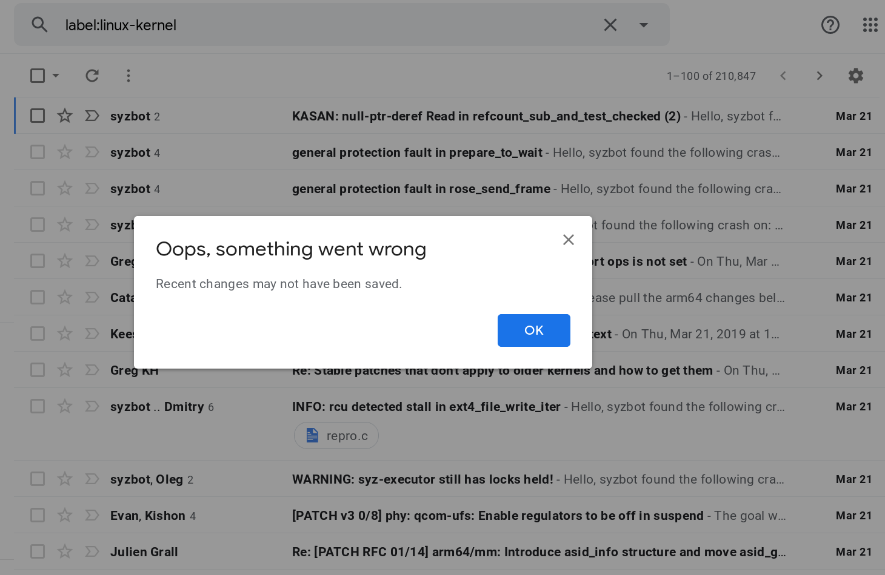
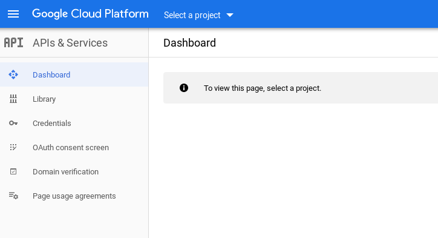
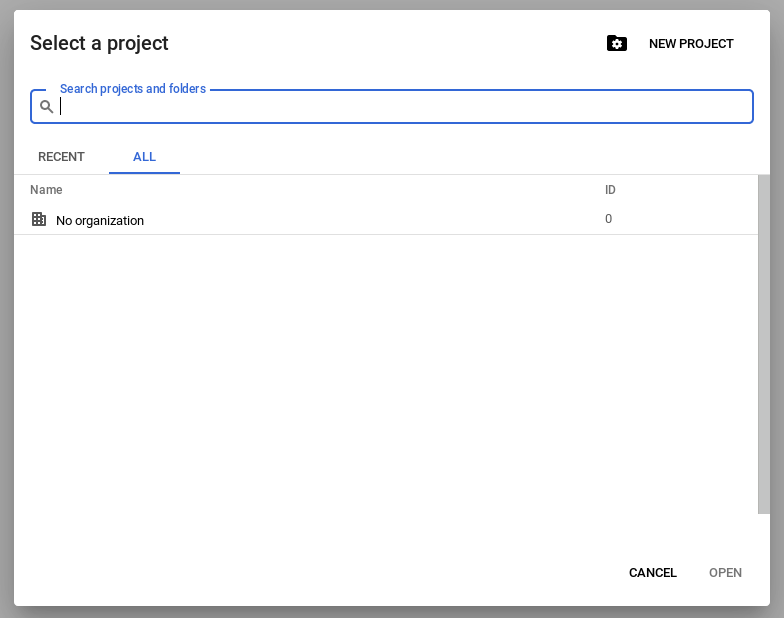
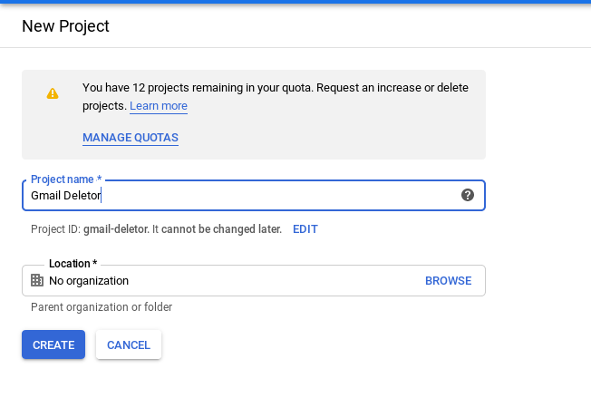
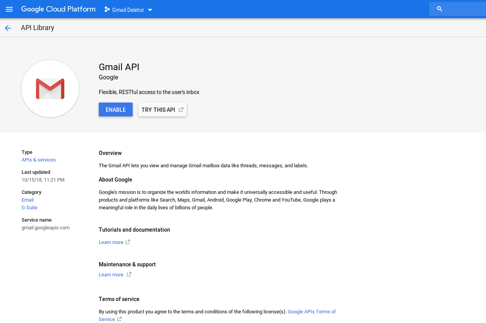
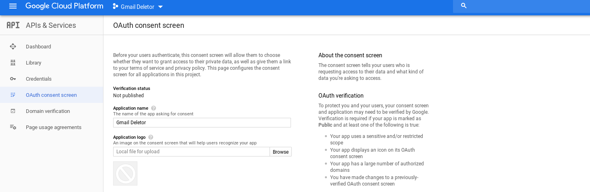
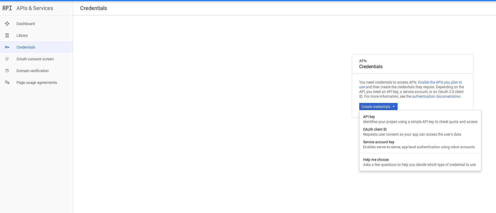
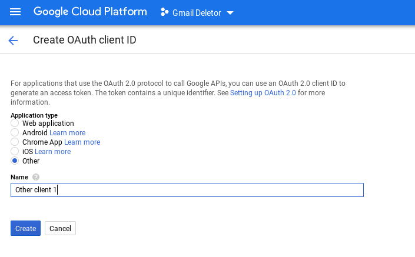

# Mass Gmail deletor.

I made the mistake of signing up for the Linux kernel mailing list and letting
it pump emails into my inbox for several months. Recently, I tried to delete
all 210,847 of them at once in Gmail, and learned that Gmail does not support
this feature. It allows us to select all of them, but when pressing the Delete
button, it displays a "Loading" flag for a while and eventually times out and
displays a message saying "Oops, something went wrong. Recent changes may not
have been saved."



This tool is my solution to this problem. Note that the focus is on deletion
rather than on viewing and functions like `View` are intended only to help with
ensuring that one is deleting the correct set of messages.

## One-time Setup

In order to sidestep the trust issues with me (hq6) hosting an application that has
access to your Gmail, you (the potential user of this application) must
create your own application from the [Google API
console](https://console.cloud.google.com/apis/api/gmail.googleapis.com/)
and then do the same setup I did to enable the app.

After creating the application, you must enable the Gmail API and then set up
the OAuth consent screen using the steps below.

1. Visit the [Google API
   console](https://console.cloud.google.com/apis/api/gmail.googleapis.com/)
   and sign in.
2. If you do not already have a project or do not want to use an existing
   project, click on Select a Project (or equivalently your current project
   name in the same part of the UI) and then New Project and give your new
   project a name.





3. Click on Select a Project again and choose your project. The Gmail API page
   should pop up now. Click the Enable button.



4. For Gmail API access, you will need OAuth credentials, so you must first set
   up the OAuth consent screen. Click on OAuth consent screen on the left and
   provide an Application Name and then click Save. Note that you do not
   actually need Google to review since only you will be using this.



5. Next, click on Credentials on the left and click OAuth Client ID. Then Click
   on Create Credentials and OAuth Client ID. Then Select Other for application
   type and click Create.





6. Download the JSON of the credentials by clicking on right of the credentials
   row and move it to a file called `client_secret.json` in the current
   directory.

## Usage

1. Start the Python interpreter in the current directory.
```
python
```

2. Import the library. The very first time you run this, follow the on-screen
   instructions to get OAuth credentials. Never share your `client_secret.json`
   or `credentials.json` file with anyone whom you do not want to grant full
   Gmail privileges to. 

```
from gmail import gmail
```

3. Preview the messages you wish to delete and then delete them if you have the courage.
```
gmail.view("label:Linux-Kernel")
gmail.autoDelete("label:Linux-Kernel")
```

## References
 * https://developers.google.com/gmail/api/auth/about-auth
 * https://developers.google.com/gmail/api/auth/web-server
 * https://developers.google.com/gmail/api/v1/reference/users/messages/list
 * https://developers.google.com/gmail/api/v1/reference/users/messages/batchDelete
 * https://developers.google.com/gmail/api/v1/reference/quota
